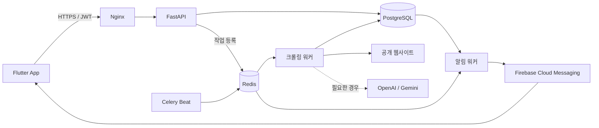

<p align="center">
  
</p>

<h1 align="center">공지저장소 (NoticeStore)</h1>

<p align="center"><strong>흩어진 공지를 한곳에 모으고, 새 소식을 놓치지 않게 하는 개인용 정보 구독 서비스</strong></p>

<p align="center">
  <a href="https://flutter.dev/"></a>
  <a href="https://fastapi.tiangolo.com/"></a>
  <a href="https://www.postgresql.org/"></a>
  <a href="./LICENSE"></a>
</p>

<p align="center"><a href="https://play.google.com/store/apps/details?id=com.noticestore.app">Google Play에서 보기</a></p>

## 프로젝트 소개

대학 공지, 장학금, 채용 공고, 지원사업처럼 중요한 정보는 여러 웹사이트에 흩어져 있습니다. 대부분 사용자가 직접 사이트를 반복해서 방문해야 하는 Pull 방식이라, 확인이 늦으면 필요한 정보와 기회를 놓치기 쉽습니다.

공지저장소는 사용자가 등록한 공개 게시판을 서버에서 주기적으로 확인하고 새 게시글을 하나의 모바일 앱으로 전달합니다. 사이트마다 다른 HTML·JSON·동적 API 구조를 자동으로 분석하고, 검증된 추출 규칙을 재사용해 지속적인 수집 비용과 오류를 줄이는 것이 핵심입니다.

> 목표는 단순한 페이지 변경 감지가 아니라, **사용자가 먼저 찾으러 가지 않아도 새 공지가 정리되어 도착하는 경험**을 만드는 것입니다.

## 주요 기능

- **사이트 등록 및 구독** — 공개 게시판 URL과 별명을 등록하면 서버가 수집 가능 여부와 데이터 구조를 백그라운드에서 분석합니다.
- **공지 통합 조회** — 여러 사이트에서 수집한 게시글을 최신순으로 모아 보고 원문으로 이동할 수 있습니다.
- **즐겨찾기와 폴더** — 중요한 공지를 계층형 폴더에 저장하고 폴더 순서를 관리할 수 있습니다.
- **키워드 기반 분류** — 폴더별 관심 키워드를 등록해 필요한 공지를 빠르게 모을 수 있습니다.
- **구독별 새 소식 표시** — 마지막으로 확인한 시점을 기준으로 새 게시글이 있는 구독을 구분합니다.
- **푸시 알림** — 전체 알림과 구독별 알림을 설정하고, 신규 공지가 수집되면 FCM으로 알림을 받습니다.
- **문의 및 운영 검토** — 앱에서 문의를 남기고, 운영자는 수집 실패 문맥과 실행 기록을 바탕으로 응답하거나 결과를 검토할 수 있습니다.

## 사용 흐름

| 단계 | 동작 |
| --- | --- |
| 1. 사이트 등록 | 관심 있는 공개 게시판의 URL과 별명을 입력합니다. |
| 2. 비동기 분석 | 서버가 접근 정책을 확인하고 실제 공지 원본과 추출 규칙을 탐색합니다. 앱은 처리 상태를 조회합니다. |
| 3. 통합 조회 | 검증을 통과한 게시글이 구독 피드에 저장되고 최신순으로 표시됩니다. |
| 4. 개인화 | 공지를 폴더에 보관하거나 키워드로 분류하고, 구독별 표시 범위와 알림을 설정합니다. |
| 5. 새 소식 수신 | 예약 수집에서 새 게시글을 감지하면 읽지 않음 상태와 푸시 알림에 반영합니다. |

## 핵심 설계

### 사이트마다 다른 수집 구조 처리

게시글이 최초 HTML에 포함된 사이트도 있고, 페이지가 열린 뒤 XHR/Fetch 요청으로 목록을 가져오는 사이트도 있습니다. 공지저장소는 Playwright로 문서와 네트워크 응답 후보를 관찰하고, HTTP 요청을 재현해 HTML·JSON·JSONP 등 실제 데이터 원본을 찾습니다.

원본 후보가 명확하면 점수와 규칙으로 선택하고, 판단이 모호할 때만 LLM을 사용합니다. 선택한 요청 정보와 추출 규칙은 저장해 다음 수집에 재사용합니다.

### 제한된 AI 추출 에이전트

AI가 게시글을 직접 생성하거나 DB에 저장하지 않습니다. AI는 모호한 원본 후보 선택, 선언형 추출 규칙 제안, 신규 규칙의 결과 평가에만 참여합니다. 제안된 규칙은 서버의 스키마 검사, 결정론적 실행, 필수 필드·URL·중복·추출 범위 검사를 모두 통과해야 활성화됩니다.

```text
원본 후보 수집 → 원본 선택 → 규칙 생성 → 서버 실행·검증 → 결과 평가 → 승인·저장
                                      │
다음 수집 ─── 저장된 원본·승인 규칙 재사용 ─┘  (정상 반복 시 LLM 호출 없음)
```

규칙 재생성 시도 횟수와 허용 동작을 제한하고, 평가 API나 응답 계약이 실패하면 결과를 저장하지 않는 fail-closed 방식을 사용합니다.

### 비동기 수집과 신뢰할 수 있는 알림

시간이 오래 걸리는 사이트 분석과 크롤링은 API 요청에서 분리해 Celery 작업으로 처리합니다. 수집 작업과 알림 작업은 별도 큐·워커로 격리하며, 사이트별 작업에는 지터를 적용해 순간 부하를 분산합니다.

새 공지와 알림 이벤트는 같은 DB 트랜잭션에서 기록합니다. 알림 워커가 즉시 처리하지 못한 이벤트는 Celery Beat가 다시 찾아 전달하고, 이벤트·기기 단위 고유 제약과 재시도로 중복 발송을 줄입니다. 사이트를 처음 등록할 때 가져온 과거 글은 알림 대상에서 제외합니다.

### 외부 URL 안전성

사용자가 입력한 URL은 HTTP/HTTPS 형식, 포트, DNS 결과를 검증합니다. 사설 IP·루프백·링크 로컬 등 내부망 주소를 차단하고 리다이렉트 이후에도 다시 검사해 SSRF 위험을 줄입니다. 외부 응답은 전송 크기와 압축 해제 크기를 각각 제한하며 기본 상한은 5 MiB입니다.

## 시스템 아키텍처



| 영역 | 기술 | 역할 |
| --- | --- | --- |
| 클라이언트 | Flutter, Provider, Dio | 인증, 구독, 피드, 즐겨찾기, 설정 화면 |
| API | FastAPI, Pydantic, Gunicorn | 인증과 REST API, 입력·응답 계약 관리 |
| 데이터 | PostgreSQL | 사용자, 구독, 공지, 추출 규칙, 실행·알림 이벤트 저장 |
| 비동기 작업 | Redis, Celery, Celery Beat | 사이트 분석, 예약 수집, 알림 전달과 복구 |
| 수집 | Playwright, HTTPX, Requests, BeautifulSoup | 동적 페이지 관찰, 요청 재현, HTML·JSON 추출 |
| AI | OpenAI 또는 Gemini | 모호한 후보 선택, 규칙 제안, 신규 결과 평가 |
| 인프라 | Docker Compose, Nginx, Firebase Admin SDK | 서비스 실행, TLS 종단, 모바일 푸시 |

## 저장소 구성

```text
NoticeStore/
├── clients/          # Flutter 클라이언트
├── dataController/   # 원본 탐색, 보안 정책, 추출 파이프라인
├── routers/          # FastAPI v1 엔드포인트
├── repositories/     # PostgreSQL 접근 계층
├── services/         # 알림·스케줄 관련 서비스
├── migrations/       # 운영 DB 변경 스크립트
├── tests/            # 백엔드 단위·회귀 테스트
├── celery_app.py     # 수집·알림 태스크와 스케줄
├── main.py           # FastAPI 애플리케이션 진입점
└── docker-compose.yml
```

## 로컬 실행

### 요구 사항

- Docker 및 Docker Compose
- Dart SDK 3.10.7 이상을 포함한 Flutter SDK와 Android/iOS 개발 환경(클라이언트 실행 시)
- Google OAuth 클라이언트 설정
- Firebase 프로젝트 및 Admin SDK 자격 증명(푸시 알림 사용 시)
- OpenAI 또는 Gemini API 키(AI 기반 신규 규칙 승인 경로 사용 시)

### 백엔드

루트에 `.env`를 만들고 환경에 맞는 값을 설정합니다. 아래 예시는 변수 이름만 보여 주며 실제 비밀값은 저장소에 커밋하지 않습니다.

```env
DB_HOST=db
DB_PORT=5432
DB_NAME=...
DB_USER=...
DB_PASSWORD=...

REDIS_URL=redis://noticestore_redis:6379/0
SECRET_KEY=...
ALGORITHM=HS256
ACCESS_TOKEN_EXPIRE_DAYS=7
GOOGLE_WEB_CLIENT_ID=...

FIREBASE_CREDENTIALS_PATH=/app/firebase-secret.json
DISCORD_WEBHOOK_URL=... # 선택 사항

LLM_PROVIDER=openai # openai 또는 gemini
OPENAI_API_KEY=...
OPENAI_MODEL=...
# Gemini 사용 시: GEMINI_API_KEY, GEMINI_MODEL

EXTRACTION_AGENT_ENABLED=false
EXTRACTION_AGENT_ROLLOUT_MODE=new_sites # new_sites 또는 all

CRAWLER_MAX_TRANSFER_BYTES=5242880
CRAWLER_MAX_DECODED_BYTES=5242880
```

Firebase 자격 증명을 사용할 경우 컨테이너에서 읽을 수 있는 경로로 별도 마운트해야 합니다. 신규 DB는 [`database/init.sql`](./database/init.sql)로 초기화됩니다. 기존 DB를 업그레이드할 때는 [`migrations/`](./migrations/)의 변경 스크립트를 적용 순서와 운영 환경에 맞게 검토한 뒤 실행하세요.

```bash
docker compose up -d --build
docker compose ps
```

배포용 Nginx 설정에는 실제 도메인과 인증서 구성이 필요합니다. API만 개발할 때는 필요한 서비스만 실행하고 컨테이너 내부 또는 로컬 개발용 포트를 통해 연결할 수 있습니다.

### Flutter 클라이언트

`clients/.env`에 API 호스트와 Google OAuth 클라이언트 ID를 설정한 뒤 실행합니다.

```env
IP_ADDRESS=api.example.com
GOOGLE_WEB_CLIENT_ID=...
```

```bash
cd clients
flutter pub get
flutter run
```

Firebase 플랫폼 설정 파일은 각자 발급받아 Android/iOS 프로젝트에 추가해야 합니다.

## 테스트

```bash
# 백엔드
docker compose exec api python -m unittest discover -s tests -p 'test_*.py'

# Flutter
cd clients
flutter test
```

LLM 공급자의 키·모델·구조화 출력 경로는 실제 API를 호출하는 별도 스모크 테스트로 확인할 수 있습니다. 이 명령은 소량의 토큰을 사용합니다.

```bash
docker compose exec api python scripts/test_llm_providers.py
docker compose exec api python scripts/test_llm_providers.py --provider gemini
```

## 수집 원칙

공지저장소는 로그인 없이 접근할 수 있는 공개 정보의 수집을 전제로 합니다. 각 사이트의 `robots.txt`, 이용 약관, 접근 정책을 존중해야 하며, 사이트 구조나 정책에 따라 등록 및 수집이 제한될 수 있습니다.

## 라이선스

이 프로젝트는 [Apache License 2.0](./LICENSE)에 따라 배포됩니다.
